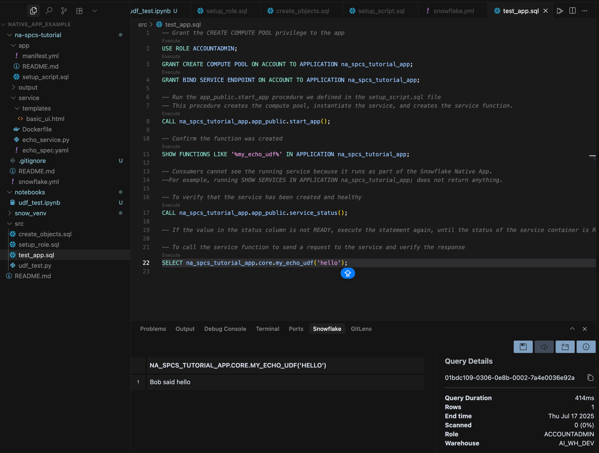
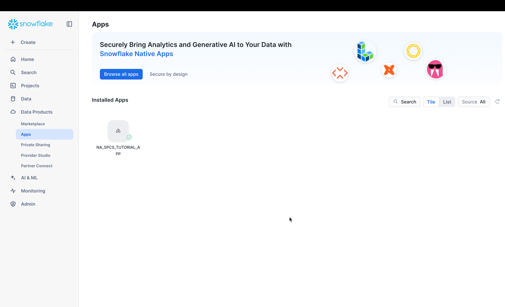

# Snowflake Native App with Snowpark Container Services

Welcome to the **Snowflake Native App with Snowpark Container Services** project!  
This project demonstrates how to build, deploy, and manage a containerized application natively within the Snowflake Data Cloud using the Snowflake Native App Framework and Snowpark Container Services.

---

## Overview

This application showcases:

- Integration with Snowflake Native App Framework
- Deployment of a containerized service (echo service) using Snowpark Container Services
- Secure sharing and management of data and application logic within Snowflake
- Automated resource creation and management via the app's setup script

The app demonstrates how to leverage modern Snowflake features for secure, scalable, data-driven apps.

---

## Features

- **Containerized Echo Service**: Run your own containerized service within Snowflake, exposed as a UDF.
- **User-Defined Functions (UDFs)**: Native SQL interface to your deployed service.
- **Service Orchestration**: Stored procedures automate service workload creation, status checks, and management.
- **Secure Roles and Privileges**: Follows Snowflake best practices for security and access control.

---

## Resources Created

During deployment and operation, the following Snowflake resources are created:

| Resource                        | Purpose                                                              |
|----------------------------------|-----------------------------------------------------------------------|
| **Role: `tutorial_role`**              | Dedicated role for app management and resource creation               |
| **Warehouse: `tutorial_warehouse`**    | Executes queries and manages computational tasks                      |
| **Database: `tutorial_image_database`**| Stores project data, image repository, and app logic                  |
| **Schema: `tutorial_image_schema`**    | Hosts the image repository and app objects                            |
| **Image Repository: `tutorial_image_repo`** | Stores Docker images for the container service                    |
| **Compute Pool**                      | Isolated compute for service execution                                |
| **Application Package**                | Bundles logic, containers, scripts, and metadata for deployment       |
| **Application Object**                 | Instantiated application, ready for procedure/function calls          |
| **Application Roles**                  | Internal app roles (e.g., `app_user`)                                 |
| **Stored Procedures**                  | - `app_public.start_app()`  \n- `app_public.service_status()`         |
| **UDF: `core.my_echo_udf()`**          | Exposes the containerized echo service                                |

---

## Setup & Deployment

### Prerequisites

- Snowflake account with Snowpark Container Services enabled
- ACCOUNTADMIN privileges (for initial setup)
- Snowflake CLI v3.0.0+
- Docker Desktop

---

### 1. Role & Permissions Setup

Run `src/setup_role.sql`

---

### 2. Create Required Snowflake Objects

Run `src/create_objects.sql`

### 3. Configure Snowflake CLI Connection

```
snow connection add

snow connection test -c tut-connection
```
See details [here](https://docs.snowflake.com/en/developer-guide/native-apps/tutorials/na-spcs-tutorial)

### 4. Initialize Project

```
snow init --template app_basic na-spcs-tutorial
```
See details [here](https://docs.snowflake.com/en/developer-guide/native-apps/tutorials/na-spcs-tutorial)

### 5. Build & Push Docker Image

1. From a terminal window, change to the `na-spcs-tutorial/service folder`.
2. Run the following Docker CLI command. Note that you must specify the current working directory (.) in the command:
```
docker build --rm --platform linux/amd64 -t my_echo_service_image:tutorial .
```
3. To identify the URL of the image repository you created in a previous section, run the following command:
```
REPO_URL=$(snow spcs image-repository url tutorial_image_database.tutorial_image_schema.tutorial_image_repo -c tut-connection)
echo $REPO_URL
```
4. To create a tag for the image that includes the image URL, run the following Docker CLI command:
```
docker tag my_echo_service_image:tutorial $REPO_URL/my_echo_service_image:tutorial
```
5. To authenticate with the Snowflake registry, run the following Snowflake CLI command:
```
snow spcs image-registry login -c tut-connection
```
6. To upload the Docker image to the image repository, run the following docker push command:
```
docker push $REPO_URL/my_echo_service_image:tutorial
```
7. Confirm the image was uploaded successfully by running the following command:
```
snow spcs image-repository list-images tutorial_image_database.tutorial_image_schema.tutorial_image_repo -c tut-connection
```

See details [here](https://docs.snowflake.com/en/developer-guide/native-apps/tutorials/na-spcs-tutorial)

### 6. Create The Application Package & Object in Your Account

```
snow app run -c tut-connection
```


### 7. Grant Privileges & Start Service

Run `src/test_app.sql`

### 8. Test the Application

```
-- Verify function
SHOW FUNCTIONS LIKE '%my_echo_udf%' IN APPLICATION na_spcs_tutorial_app;

-- Check service status
CALL na_spcs_tutorial_app.app_public.service_status();

-- Use the sample function
SELECT na_spcs_tutorial_app.core.my_echo_udf('hello');
```


## Teardown & Cleanup

```
snow app teardown --cascade --force -c tut-connection
```

---

## Further Information

- See the [official Snowflake documentation](https://docs.snowflake.com/en/developer-guide/native-apps/tutorials/na-spcs-tutorial) for in-depth guidance.
- This project is for learning/demonstration. Adapt for security and production best practices before real use.

## Results

### Call Service Function Produces Output



### App Is Installed

